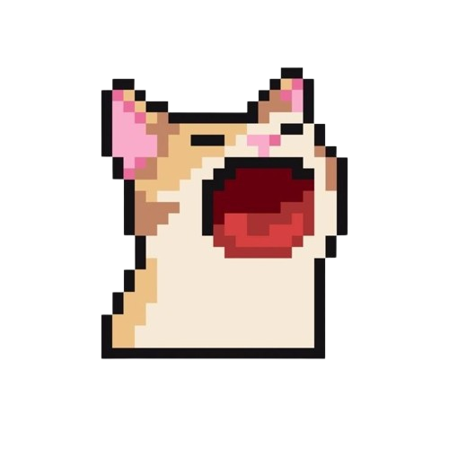
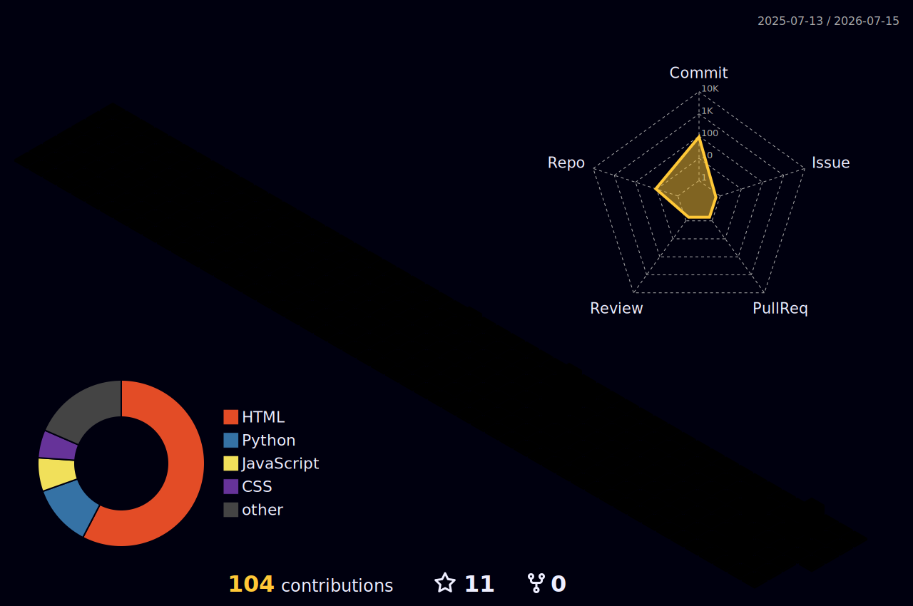

<div align="center">
  
</div>

#  Md Rana

> Building useful software. Learning deeply. Shipping consistently.

`Python` · `JavaScript` · `Node.js` · `c++` · `c` · `HTML` · `CSS`

---

## /about

I'm a Computer Science student from West Bengal, India.

I enjoy building backend projects, Discord bots, and learning how software works under the hood. Most of my projects start as experiments and become opportunities to learn something new.

---

## /now

```bash
$ now

learning
├── Data Structures & Algorithms
├── Networking
└── Backend Development

building
├── Discord Bot
└── Personal Projects

next
└── First Open Source Contribution
```

---

## /toolbox

| Category | Technologies |
|----------|--------------|
| Languages | Python · JavaScript · HTML · CSS |
| Backend | Node.js |
| Tools | Git · GitHub · Linux · VS Code |
| Currently Learning | AI · Machine Learning |

---

## /selected-work

### 🎵 Discord Bot
A music & utility bot built with Discord.js and Node.js.

### 🤖 AI Experiments
Small projects exploring machine learning concepts and automation.

### 💻 LeetCode Journey
Documenting my progress while learning algorithms and problem solving.

---

## /recent

> Repositories I've been working on lately.

| Repository | Description |
|:--|:--|
| [🤖 woott07](https://github.com/woott07/woott07) | My GitHub profile README |
| [🎵 Snax bot](https://github.com/woott07/Snax-bot) | Music & utility bot built with Discord.js |
| [🧪 Website](https://github.com/woott07/Snax-web) | Discord bot Website |
| [💻 LeetCode](https://github.com/woott07) | DSA problem-solving journey |

---

## /contributions

> Every green square represents time spent learning.

<p align="center">

</p>

---

## /philosophy

```python
def alive():
    while True:
        sleep()
        eat()
        code()
        repeat()
```

---

## /quote

> *"Error 404: My brain is not loading..."*
> — Me


---

## /connect

- GitHub: https://github.com/woott07
- LinkedIn: https://www.linkedin.com/in/md-rana-a686b83a6/
- Email: 

---

<sub>Thanks for stopping by.</sub>
