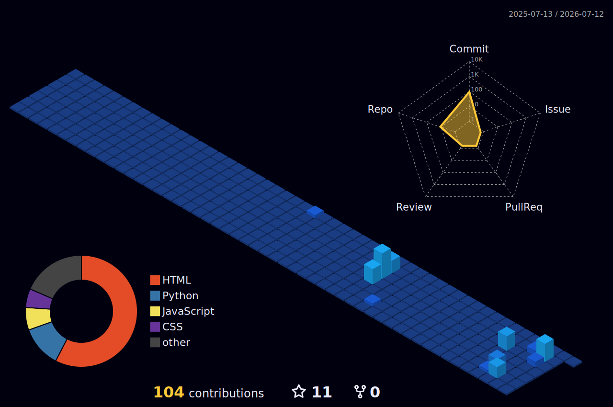

# Md Rana

> Building useful software. Learning deeply. Shipping consistently.

`Python` · `JavaScript` · `Node.js` · `AI/ML`

---

## /about

I'm a Computer Science (AI & ML) student from West Bengal, India.

I enjoy building backend projects, Discord bots, and learning how software works under the hood. Most of my projects start as experiments and become opportunities to learn something new.

---

## /now

```bash
$ now

learning
├── Data Structures & Algorithms
├── Machine Learning
└── Backend Development

building
├── Discord Bot
└── Personal Projects

next
└── First Open Source Contribution
```

---

## /toolbox

| Category | Technologies |
|----------|--------------|
| Languages | Python · JavaScript · HTML · CSS |
| Backend | Node.js |
| Tools | Git · GitHub · Linux · VS Code |
| Currently Learning | AI · Machine Learning |

---

## /selected-work

### 🎵 Discord Bot
A music & utility bot built with Discord.js and Node.js.

### 🤖 AI Experiments
Small projects exploring machine learning concepts and automation.

### 💻 LeetCode Journey
Documenting my progress while learning algorithms and problem solving.

---

## /github

<p align="center">


</p>

---

## /contributions

> Every green square represents time spent learning.

<p align="center">

</p>

---

## /philosophy

```cpp
while (alive) {
    learn();
    build();
    improve();
}
```

---

## /connect

- GitHub: https://github.com/woott07
- LinkedIn: https://www.linkedin.com/in/md-rana-a686b83a6/
- Email: sowelra0786@gmail.com

---

<sub>Thanks for stopping by.</sub>
