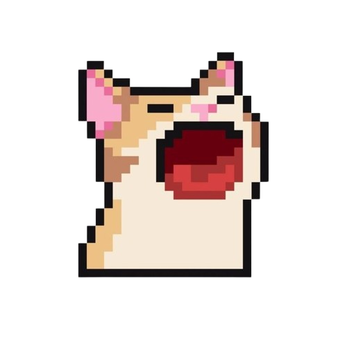
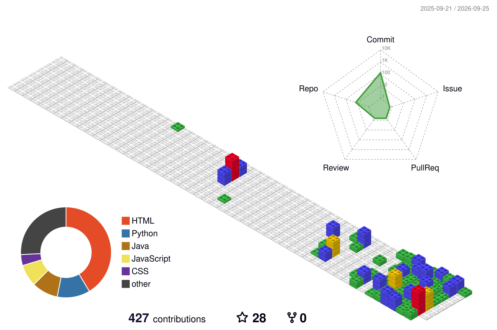

<div align="center">
  
</div>

#  Md Sowel Rana 

<div align="center">
  <a href="https://github.com/woott07">
    
  </a>
</div>

<p align="center">
  
  
  
  
  
</p>

---

## /about 

I'm a **Computer Science** student at **Sister Nivedita University, Kolkata**, passionate about backend development, Android applications, Discord bots, and AI/ML.

I enjoy building practical software, exploring how systems work under the hood, and learning through hands-on experimentation. From offline encrypted Android apps to scalable audio streaming bots, I turn ideas into clean, functional projects.

---

## /now

```bash
$ now

role
└── 🎓 Google Student Ambassador

learning
├── 🤖 AI / Machine Learning & Data Science Concepts
├── 📱 Android Architecture & Jetpack Compose
└── 💻 Data Structures & Algorithms

building
├── 🔋 Battery Life (Encrypted Offline Android App)
└── 🎵 Snax Bot (Lavalink Music Bot)
```

---

## /toolbox

| Category | Technologies & Tools |
|----------|----------------------|
| **Languages** | Python · JavaScript · Kotlin · C |
| **Backend & APIs** | Node.js · REST APIs |
| **Mobile & Web** | Jetpack Compose · HTML · CSS |
| **Database & Security** | Room · SQLCipher · AndroidX Security |
| **Tools & Platforms** | Git · GitHub · Linux · CLI · Android Studio · WorkManager |
| **AI/ML & Data** | AI/ML Fundamentals · Data Science Concepts |

---

## /education

- **Sister Nivedita University, Kolkata**
  - **Degree**: Bachelor of Technology (B.Tech) in Computer Science
  - **Duration**: July 2026 – May 2030

---

## /certifications & achievements

- 🌟 **Google Student Ambassador**
- 🐍 **Python for Data Science, AI & Development**
- 🛡️ **Deloitte Australia** – Technology Job Simulation & Cyber Job Simulation
- 🌐 **Introduction to HTML, CSS & JavaScript**
- 🏆 **Fresher's Party Night Challenge II**

---

## /recent

> Repositories & work I've been focusing on:

| Repository | Description |
|:--|:--|
| [🤖 woott07](https://github.com/woott07/woott07) | My GitHub profile README |
| [🔋 batteryLife](https://github.com/woott07/batteryLife) | Offline encrypted Android battery & screen-time tracker |
| [🎵 Snax-Bot](https://github.com/woott07/Snax-Bot) | Lavalink-based Discord music bot |
| [🧪 Snax-web](https://github.com/woott07/Snax-web) | Discord bot web interface |

---

## /stats

<p align="center">
  
</p>

<p align="center">
  
  &nbsp;
  
</p>

---

## /contributions

> Every block represents time spent learning and building.

<p align="center">
  
</p>

---

## /philosophy

```python
def alive():
    while True:
        sleep()
        eat()
        code()
        repeat()
```

---

## /quote

> *"Error 404: My brain is not loading.."*
> — Me

---

## /connect

- **Email**: [sowelrana006@gmail.com](mailto:sowelrana006@gmail.com)
- **LinkedIn**: [Md Rana](https://www.linkedin.com/in/md-rana-a686b83a6/)
- **GitHub**: [woott07](https://github.com/woott07)

---

<sub>Thanks for stopping by!</sub>
